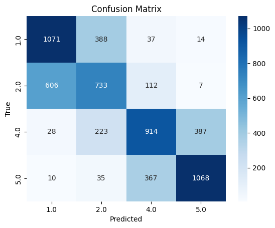
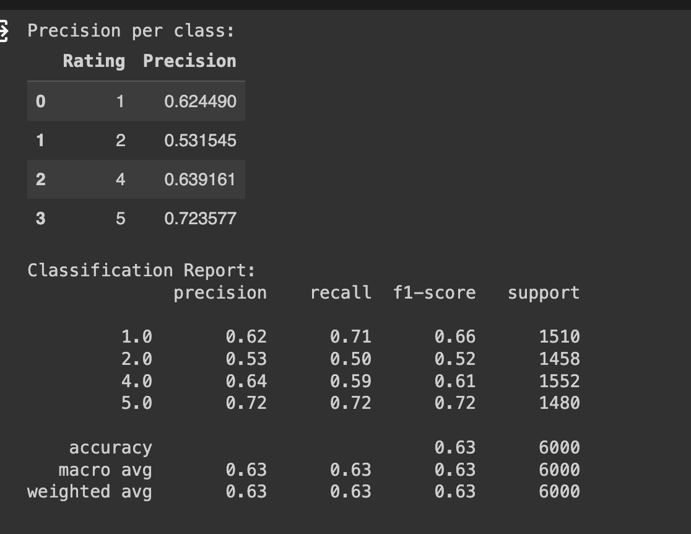
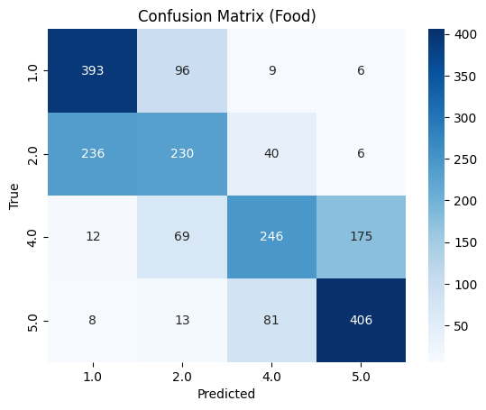
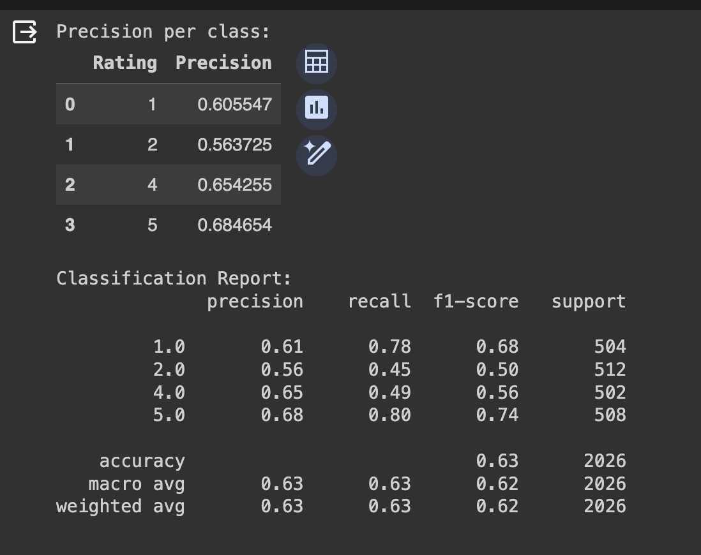

# FAIR: Feedback Analysis and Intelligent Rating
Generate FAIR ratings with a NLP + Neural network pipeline powered by BART from Meta.

## I. Motivation

In the realm of product reviews on shopping platforms, assigning star ratings can be challenging due to subjective interpretation. Many users resort to binary extremes, giving 1 or 5 stas without nuanced evaluatio.This polarization hampers the effectiveness of conventional rating prediction models, leading to imbalance issues in input datasets.

Current systems relying on star ratings for product recommendations often prove unreliable, prompting a dependence on sponsorships and biased reviews from influencers. Our solution, the FAIR system (Feedback Analysis and Intelligent Rating), addresses this by employing a BART-based Zero-Shot Sequence Classifier trained on the MultiNLI dataset. This powerful classifier extracts key qualifications from review texts, enabling accurate emotion capture and eliminating the need for explicit keywords. The use of a diverse training dataset enhances the model's generalization performance across different genres. FAIR aims to provide a more informative and reliable approach to product evaluation on shopping platforms.

## II. Flow

## III. Results

### On the test set spawned from our training dataset

### On the test set spwned from Fine Food Dataset

## III. To navigate through our notebooks

1. **explore_data.ipynb**: To understand the distributions of our dataset
2. **balance_data.ipynb**: To address the imbalance of the dataset
3. **apply_bart_label_batched.ipynb**: To apply tags with BART to the entire balanced dataset (takes hours)
4. **train_model.ipynb**: To train the neural network mentioned in graph
5. **model_evaluation.ipynb**: Inspect train results
6. **model_demo.ipynb**: Play around with the model!

## Works Cited

1. **Input Dataset** Amazon Reviews on Cell Phones & Accessories section:  https://www.kaggle.com/datasets/abdallahwagih/amazon-reviews/data
2. **Nishit Shrestha et al.** Deep Learning Sentiment Analysis of Amazon.com Reviews and Ratings https://arxiv.org/abs/1904.04096
3. **Amazon Fine Food reviews Dataset** https://www.kaggle.com/datasets/snap/amazon-fine-food-reviews
4. **bart-large-mnli**: https://huggingface.co/facebook/bart-large-mnli
